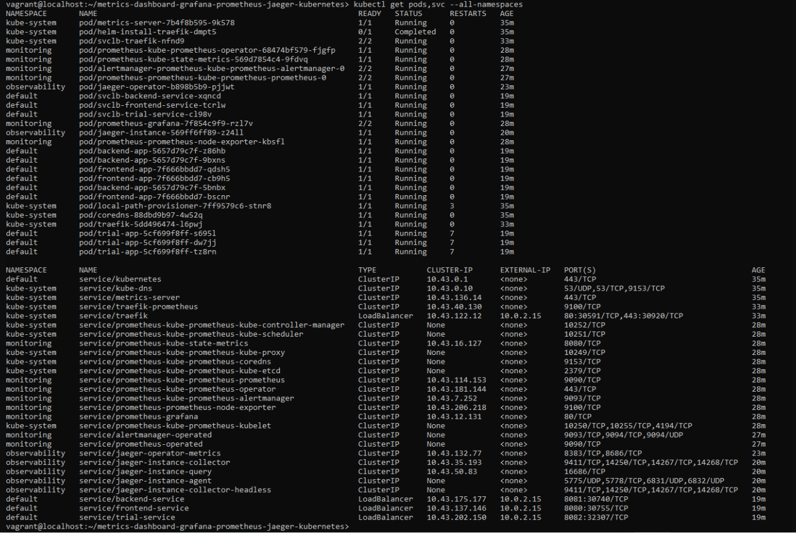
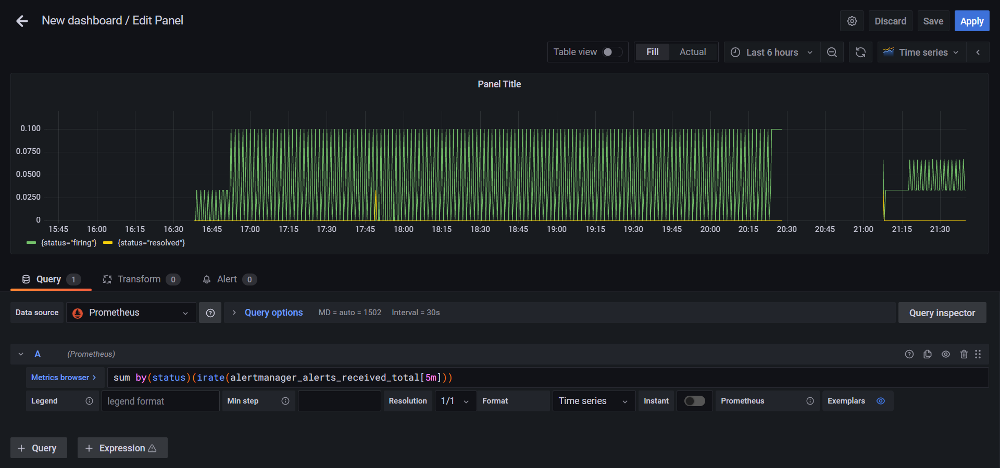
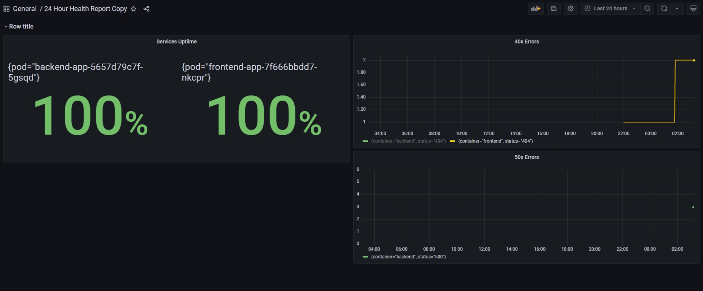
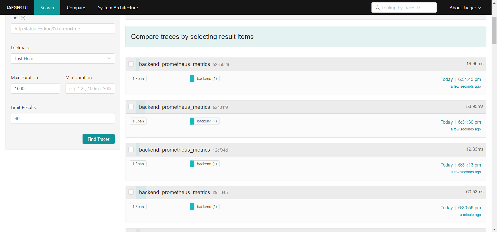
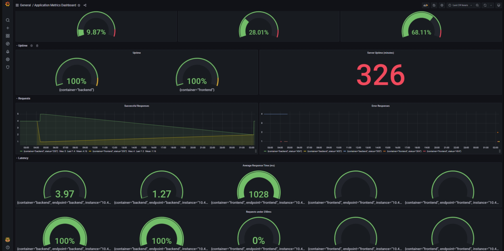

**Note:** For the screenshots, you can store all of your answer images in the `answer-img` directory.

## Verify the monitoring installation

*TODO:* run `kubectl` command to show the running pods and services for all components. Take a screenshot of the output and include it here to verify the installation

## Setup the Jaeger and Prometheus source
*TODO:* Expose Grafana to the internet and then setup Prometheus as a data source. Provide a screenshot of the home page after logging into Grafana.

## Create a Basic Dashboard
*TODO:* Create a dashboard in Grafana that shows Prometheus as a source. Take a screenshot and include it here.

## Describe SLO/SLI
*TODO:* Describe, in your own words, what the SLIs are, based on an SLO of *monthly uptime* and *request response time*.

Let's assume that we are a software compnay providing SaaS solutions to customers and our SLO is: We guarantee 99% software uptime every month and 90% of monthly requests in less than 300ms.

To ensure that we are meeting these objectives we measure the SLIs at the end of each month:
    - At the end of October, we had a monthly CRM uptime of 95% so we have achieved our SLO here.
    - 93% of our October requests to the backend service responded in less than 300ms. Hence we met this SLO as well. 

## Creating SLI metrics.
*TODO:* It is important to know why we want to measure certain metrics for our customer. Describe in detail 5 metrics to measure these SLIs. 

1. Latency or the amount of time in ms it takes for a request to be proccessed and returned to the requester.
2. Disk, cpu and ram utilization - if either one of those is used at its maximum our response time would decrease due to lack of resources and it may lead to a failure hence also takes away from our uptime.
3. Error rate or the number of errors requests during a month - errors take away from our uptime so we need to monitor them.
4. Uptime or percentage of our monthly time the service was in the fully operational state.
5. Traffic or the number of HTTP requests per second showing us how highly used our system is. Higher usage means the chance to overstress the system if we are not prepared for the incoming traffic.

## Create a Dashboard to measure our SLIs
*TODO:* Create a dashboard to measure the uptime of the frontend and backend services We will also want to measure to measure 40x and 50x errors. Create a dashboard that show these values over a 24 hour period and take a screenshot.

## Tracing our Flask App
*TODO:*  We will create a Jaeger span to measure the processes on the backend. Once you fill in the span, provide a screenshot of it here.

## Jaeger in Dashboards
*TODO:* Now that the trace is running, let's add the metric to our current Grafana dashboard. Once this is completed, provide a screenshot of it here.

## Report Error
*TODO:* Using the template below, write a trouble ticket for the developers, to explain the errors that you are seeing (400, 500, latency) and to let them know the file that is causing the issue.

TROUBLE TICKET

Name: 500 Server Error on Star endpoint of Backend app

Date: 2/11/2021 19:36:25

Subject: MongoDB connection failure

Affected Area: /star API endpoint of Backend app

Severity: High

Description: Star endpoint accepts POST requests but is unable to connect to MongoDB database. Either connection is poor or the database does not exist

## Creating SLIs and SLOs
*TODO:* We want to create an SLO guaranteeing that our application has a 99.95% uptime per month. Name three SLIs that you would use to measure the success of this SLO.

1. Application uptime of 99.95% per month
2. More than 99% of monthly requests should be successful and error free
3. The server resources should not exceed 90% utilization per month
4. The response time of 90% of monthly requests should not exceed 1500ms

## Building KPIs for our plan
*TODO*: Now that we have our SLIs and SLOs, create KPIs to accurately measure these metrics. We will make a dashboard for this, but first write them down here.

- Disk Drive Utilization < 90%
- RAM Memory Utilization < 90%
- CPU Utilization < 90%
- Successful responses per month > 99.90% of requests
- Error responses per month < 0.1% of requests
- Server Uptime > 99.95%
- Deployment Uptime > 99.95%
- Average Response Time < 300ms
- Percentage of requests with latency of less than 300ms > 95%

## Final Dashboard
*TODO*: Create a Dashboard containing graphs that capture all the metrics of your KPIs and adequately representing your SLIs and SLOs. Include a screenshot of the dashboard here, and write a text description of what graphs are represented in the dashboard.  

Drive Usage - how much disk drive space is being used currently.
Memory Usage - how much RAM memory is being used currently.
CPU Usage - how much cpu is being used currently.
Successful Responses - total number of successful requests per month by containers.
Error Responses - total number of error requests per month by containers and statuses.
Server Uptime - how many minutes passed since the server was booted up.
Deployment Uptime - uptime of the backend and frontend services.
Average Response Time - average response time in ms measured over 1 hour intervals for successful requests. Shown per path.
Requests under 300ms - percentage of successful requests finished within 300ms. Shown per path.